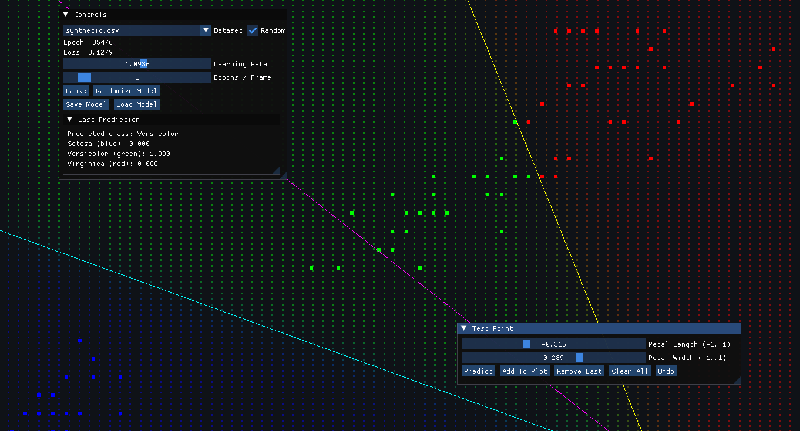

# ML-Visualizer

Interactive visualization tool for exploring machine learning models, training dynamics, and datasets.

This project provides a lightweight C++ application that uses OpenGL and Dear ImGui to render datasets and visualize model behaviour during training. It is intended as a learning and debugging aid for small ML models (e.g., classifiers and simple regressors) and synthetic datasets.

## Features

- Visualize 2D datasets and model predictions in real time
- Display training metrics and loss surfaces via ImGui panels
- Load CSV datasets (see `dataset/`) and toggle dataset samples
- Cross-platform build using CMake (tested on Windows)

## Repository layout

- `src/` — application source (`main.cpp`, `renderer.cpp`, `model.cpp`, `dataset.cpp`)
- `include/` — bundled third-party headers (GLFW, GLEW, ImGui)
- `dataset/` — sample CSV datasets (`iris.csv`, `synthetic.csv`, `synthetic_nonlinear.csv`)
- `build/` — CMake out-of-source build directory (ignored in VCS)
- `lib/` — (optional) native libs if required by your platform

## Requirements

- CMake 3.10+
- A C++17-capable compiler (MSVC, GCC, Clang)
- OpenGL development headers (usually provided by your graphics SDK)
- Optional: Visual Studio (Windows) or make + gcc/clang (Linux/macOS)

## Build (Windows example)

1. Create a build directory and run CMake:

```powershell
mkdir build; cd build
cmake .. -G "Visual Studio 16 2019"  # adjust generator for your VS version
cmake --build . --config Release
```

2. Alternatively, generate Ninja or Makefiles and build with your preferred toolchain.

## Run

After building, run the executable produced in the `build` directory. On Windows with Visual Studio configuration:

```powershell
.
# from the build folder, example path (adjust as needed):
./build/ML_Visualizer.exe
```

The app opens an interactive window where you can:
- Select a dataset from `dataset/`
- Toggle model parameters and training options in the ImGui panel
- Watch model predictions and metrics update in real time



## Datasets

Included sample datasets:
- `dataset/iris.csv` — classic iris classification data (2D projection)
- `dataset/synthetic.csv` — linearly-separable synthetic points
- `dataset/synthetic_nonlinear.csv` — non-linear synthetic dataset

You can add your own CSVs (comma-separated) with two columns for X/Y and an optional label column; update the loader in `src/main.cpp` if your format differs.

## Contributing

Contributions are welcome. Open an issue or submit a pull request with a clear description and a small, focused change. Please follow the repository style and test builds on your platform.


---
